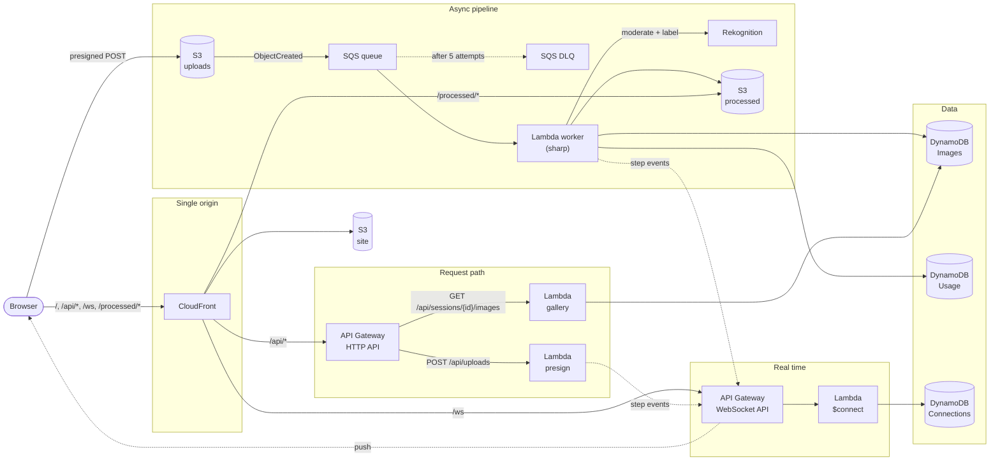

# Cloud Relay

I'm a software engineer who has spent most of my time on Shopify. I wanted to learn AWS, and reading docs only gets you so far. So I built something small and made myself use the real services: **upload a photo and watch it travel through AWS.**

The page shows a live architecture diagram. Each node (CloudFront, API Gateway, Lambda, S3, SQS, Rekognition, DynamoDB, WebSocket) lights up when that step actually happens, with timings measured by the backend. Nothing is faked on a timer. If a node is lit, AWS really did the work.

**Live demo:** https://dwvpsyuuqplr5.cloudfront.net

<!-- Demo GIF goes here -->

## What happens when you upload a photo

1. You pick a photo (JPEG, PNG or WebP, up to 5 MB).
2. The browser asks the API for a short-lived upload URL and sends the file straight to S3.
3. A worker resizes it, checks it for unsafe content, tags it with labels and saves a record.
4. Every step reports itself over a WebSocket, so the diagram, timeline and result card update live.
5. Your processed photos show up in a gallery. Everything is deleted after a day.

Every Lambda emits typed `StepEvent`s ([`packages/shared/src/events.ts`](packages/shared/src/events.ts)), and the diagram only moves when one arrives.

## Please be nice

This runs on my own AWS account with a spend limit, and I would like to keep my lunch money. Please don't hammer it, script it or upload the entire internet. I have throttles, caps and a budget alarm, but mostly I have hope. Upload a few photos, poke at the diagram, and then go outside.

## Architecture



Everything is served from one CloudFront domain: the SPA from a private S3 bucket, the HTTP API under `/api/*`, the WebSocket under `/ws` and processed images under `/processed/*`. The browser needs no CORS setup and no runtime config.

### How a request flows

These are the ten steps the diagram animates. Each one is reported by the component that performs it.

| Step       | Service                 | What happens                                                                                                                                                |
| ---------- | ----------------------- | ----------------------------------------------------------------------------------------------------------------------------------------------------------- |
| `edge`     | CloudFront              | Receives `POST /api/uploads` at the nearest edge. It runs none of our code, so the presign Lambda reports it from the `x-amz-cf-id` header CloudFront adds. |
| `api`      | API Gateway (HTTP)      | Applies throttling and invokes the presign Lambda. Timed from API Gateway's request time to the handler starting, cold start included.                      |
| `presign`  | Lambda                  | Validates the request with zod and signs an S3 presigned POST that pins the key, content type and size (valid for 60 s).                                    |
| `upload`   | S3                      | The browser POSTs the file straight to the uploads bucket. The worker times it from the run ID (a UUIDv7, so it carries a timestamp) to S3's event time.    |
| `enqueue`  | SQS                     | An S3 event notification lands in the queue and Lambda picks it up. Includes the attempt number.                                                            |
| `resize`   | Lambda (sharp)          | Rotates, strips EXIF and writes a 1280 px display and a 320 px thumbnail as WebP to the processed bucket.                                                   |
| `moderate` | Rekognition             | `DetectModerationLabels` on an in-memory JPEG. A blocked category deletes the original and the outputs, and the run ends as "rejected".                     |
| `label`    | Rekognition             | `DetectLabels` returns the top labels (≥ 75 % confidence).                                                                                                  |
| `persist`  | DynamoDB                | The image record (status, keys, sizes, labels) is written to the Images table.                                                                              |
| `notify`   | API Gateway (WebSocket) | The final result is pushed to every open tab of the session.                                                                                                |

If a worker attempt fails, SQS retries it (5 s apart) and the diagram shows each attempt. After five failed attempts the message moves to the dead-letter queue. The upload panel has a **Simulate failure** checkbox that signs a flag into the upload so you can watch this happen.

If the WebSocket drops mid-run, the gallery refetches on reconnect and the run is completed from its DynamoDB record. Steps whose events were missed are marked "event missed" instead of being painted green.

## Stack

- **Web:** React Router v8 (SPA mode), TypeScript, Tailwind v4, React Flow, Motion
- **Backend:** TypeScript Lambdas on Node.js 24 (arm64), bundled with esbuild; sharp for images; zod schemas shared with the browser
- **Infra:** AWS CDK v2 (TypeScript), split into a stateful and a stateless stack
- **Tooling:** npm workspaces, Vitest, ESLint, Prettier, GitHub Actions (checks only)

```
apps/web          React Router SPA: diagram, timeline, upload panel, gallery
packages/shared   zod schemas and constants shared by the browser and the Lambdas
services/api      presign and gallery Lambdas (HTTP API)
services/workers  image worker Lambda (SQS → sharp → Rekognition → DynamoDB)
services/realtime $connect Lambda and the step-event emitter
infra             CDK app: StatefulStack and StatelessStack
```

## DynamoDB access patterns

Three on-demand tables, each designed around the queries the app makes. No scans and no secondary indexes.

| Table           | Key                                 | Access pattern                                                                                        | Who                            |
| --------------- | ----------------------------------- | ----------------------------------------------------------------------------------------------------- | ------------------------------ |
| **Images**      | PK `sessionId`, SK `runId` (UUIDv7) | Write one record per upload                                                                           | worker (`PutItem`)             |
|                 |                                     | List a session's images, newest first: `Query` by `sessionId`, `ScanIndexForward: false`, `Limit: 24` | gallery Lambda                 |
| **Usage**       | PK `day` (UTC date)                 | Count today's Rekognition calls and refuse past 200: one conditional `UpdateItem` with `ADD`          | worker                         |
| **Connections** | PK `sessionId`, SK `connectionId`   | Register an open WebSocket                                                                            | $connect (`PutItem`)           |
|                 |                                     | Find a session's open tabs on every emit: `Query` by `sessionId`                                      | presign, worker                |
|                 |                                     | Forget a closed tab when posting returns `410 Gone`                                                   | presign, worker (`DeleteItem`) |

Run IDs are UUIDv7s, which sort by creation time, so "newest first" is just a reverse range read on the sort key. Every table has a TTL attribute (`expiresAt`): image records after a day, connections after two hours (the longest a WebSocket can live), counters after two days. TTL deletes can lag, so readers also filter on `expiresAt`.

## Run locally

Requires Node.js 24 (`nvm use`).

```bash
npm install
npm run dev     # http://localhost:5173
npm run check   # lint, format, typecheck, tests, cdk synth
```

`npm run dev` runs the UI against a scripted mock event stream that uses the real `StepEvent` schema, so you can explore the diagram without an AWS account. Real uploads need the deployed backend.

## Deploy

You need an AWS account, the AWS CLI signed in (for example `aws login`), and Node.js 24. The stacks deploy to the Region in [`infra/lib/config.ts`](infra/lib/config.ts) (`us-east-2`; Rekognition's moderation and label APIs aren't available in every Region). The account comes from your credentials and is never stored in the repo.

```bash
export ALERT_EMAIL=you@example.com                 # where alarm and budget emails go
npm ci
npm run build -w @cloud-relay/web                  # the stacks upload this build
npm exec -w @cloud-relay/infra -- cdk bootstrap    # once per account and Region
npm run diff                                       # optional: review the changes
npm run deploy                                     # builds the web app, deploys both stacks
```

`ALERT_EMAIL` (or `-c alertEmail=…`) is required whenever CDK finds credentials, so a deploy can't drop the email subscription and the budget by accident. AWS emails a confirmation link first: click it, or the alarms won't reach you.

The `SiteUrl` output of the stateless stack is the demo's URL.

## Teardown

```bash
export ALERT_EMAIL=you@example.com                 # any address; the app needs one to synthesize
npm run build -w @cloud-relay/web
npm exec -w @cloud-relay/infra -- cdk destroy --all
```

The site, uploads and processed buckets are kept on destroy so a stack change can't empty them. Delete them afterwards (the processed and uploads buckets empty themselves within a day):

```bash
aws s3 ls | grep cloudrelaystateful               # find the three bucket names
aws s3 rb s3://<bucket-name> --force              # empty and delete each one
```

The CDK bootstrap stack (`CDKToolkit`) stays too. Delete it in the CloudFormation console if you no longer use CDK in that Region.

## License

[MIT](LICENSE)
